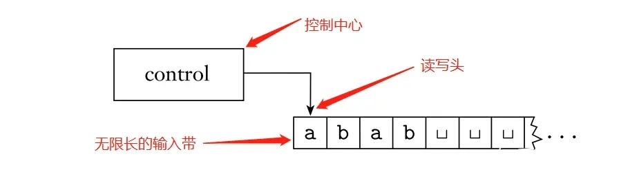

# 计算机科学简介（上）

&emsp;&emsp;什么是算法？这个问题至今也没有一个精确的数学定义。现代计算理论一般从**图灵机**出发，认为算法就是图灵机工作的精确步骤，也就是**执行某些任务的精确方法**。
&emsp;&emsp;本章节将介绍图灵机这个计算模型，并提供电路这一种实现图灵机的方式。接着我们将讨论哪些问题是可计算的，哪些是不可计算的，执行给定算法需要的资源等等问题。最后我们将简单提及量子计算模型的计算能力，并将其与经典计算相比较。

## 形式语言与图灵机

### 1.形式语言

&emsp;&emsp;显然我们说的每一句话都是字符串，而语言是我们听得懂的字符串的集合。
&emsp;&emsp;假设我们有一个字符集 $\Sigma$，定义**字符串** $s$ 是字符集元素的**有限**序列：$s=s_1s_2\dots s_k ,\forall i,s_i\in \Sigma$，其中 $k$ 被称为字符串的长度。字符串也在某些地方被称作单词。
&emsp;&emsp;显然，这个字符集中的字符可以组成无数的字符串，所有字符串构成一个字符串全集 $\Sigma^*$.要注意的是**空串** $\epsilon$ 始终属于字符串全集。
&emsp;&emsp;**语言**是字符串的集合 $L \subseteq \Sigma^*$ ，不属于语言集合的字符串 $t$ 会被视为乱码。

> 例：$\Sigma =\{a,b,n\}$，$L=\{ban,anna\}$，$s=ban \in L$，$t=banana \notin L$
> &emsp;&emsp;如果 $\Sigma'$ 是所有拉丁字母，$L'$ 是英语，那么 $ban,anna,banana$ 都属于 $L'$.
> &emsp;&emsp;从这里可以看出，语言是不断发展和变化的，随时可能有一个单词被加入语言或是语言中移除（创造新词或是不再流行而弃用）。

&emsp;&emsp;对于一门语言 $L$，如果某个过程 $M$ 能在有限步之内，对于任意 $L$ 中的字符串 $s\in L$ 给出 $s$ 确实属于 $L$ 的判断，则称 $M$ 识别语言 $L$.
&emsp;&emsp;进一步地，如果 $M$ **还能够**对于任意不在 $L$ 中的字符串 $s\notin L$ 给出 $s$ 不属于 $L$ 的判断，则称 $M$ 判定语言 $L$.

### 2.图灵机模型

&emsp;&emsp;图灵机是由阿兰·图灵在哥德尔研究的基础上提出的一种计算模型。它由三部分组成：一条代表内存的、可擦写的、其中一端无限延伸的**纸带**；一根在纸带上面移动、可以读取或是擦写纸带内容的**读写头**；一个控制读写头移动和做出读取、擦写、移动等动作的**状态控制器**。

&emsp;&emsp;在图灵机的运行过程，读写头会读取当前纸带上的字符，然后根据当前状态控制器的状态来改变①当前读写头所指向的字符；②读写头的位置，至多可以向左或向右移动一格；③控制器的状态。不论读写头的位置在哪里，**只要状态控制器和读写头读取的字符是相同的，图灵机总是会做出相同的动作**。
&emsp;&emsp;初始时，纸带上可以有一些字符，被称为**输入字符串**，而其它位置都是空字符，读写头位于纸带的**最左端**，状态控制器处于某个**初始状态**。状态控制器有两个特殊的状态 $q_{accept}$ 和 $q_{reject}$，一旦进入这两个状态之一，图灵机就会**停机**，立刻停止工作（此时纸带上的字符串被称为**输出字符串**）。其中，如果停止在 $q_{accept}$，称图灵机**接受**该输入；停止在$q_{reject}$，称图灵机**拒绝**该输入。
&emsp;&emsp;形式化地，我们可以用这样一个七元组来在数学上定义图灵机：

> 定义：图灵机 $M$ 是一个七元组， $M=(Q,\Sigma,\Gamma,\delta,q_0,q_{accept},q_{reject})$，其中：
> 1. $Q$ 是状态控制器的状态集
> 2. $\Sigma$ 是输入字母表
> 3. $\Gamma$ 是纸带字母表，其中必定有一个特殊字符 $\sqcup \notin \Sigma$，表示空字符。另外必须满足 $\Sigma \subseteq \Gamma$。
> 4. $\delta:Q\times \Gamma \rightarrow Q\times \Gamma \times \{L,R\}$ 是转移函数。如果读写头已经在纸带的最左边，并且当前发送给读写头的指令是左移，那么读写头保持不动。
> 5. $q_0 \in Q$ 是状态控制器的起始状态。
> 6. $q_{accept} \in Q$ 是接受状态。
> 7. $q_{reject} \in Q$ 是拒绝状态，满足 $q_{accept} \not = q_{reject}$。

&emsp;&emsp;由以上定义可知，只要确定了图灵机的初始状态和输入字符串，图灵机就可以完全不受干预地运行，并且落进哪一个终止状态亦或者是不会停机都是完全确定的。下面我们来分享一个图灵机的实例：

> 例：以下图灵机 $M$ 判定输入的 $0$ 的个数的是偶数。
> 有一图灵机 $M=(Q,\Sigma,\Gamma,\delta,q_0,q_{accept},q_{reject})$，其中：
> 1. $Q=\{q0,q1,q_{accept},q_{reject}\}$
> 2. $\Sigma = \{0\}$
> 3. $\Gamma = \{0,\sqcup\}$
> 4. $\delta$ 满足：
> $$\begin{cases}
\delta(q_0,0)=<q_1,0,R>\\
\delta(q_1,0)=<q_0,0,R>\\
\delta(q_0,\sqcup)=<q_{accept},\sqcup,R>\\
\delta(q_1,\sqcup)=<q_{reject},\sqcup,R>
 \end{cases}$$

&emsp;&emsp;这个例子中，$q_0$ 既作为初始状态，也作为表示当前个数为偶数的状态；$q_1$ 表示奇数状态。读写头不断向右移动直到读完所有的 $0$ 字符。
&emsp;&emsp;一台图灵机可以以 $\Sigma^*$
这个图灵机的字符串全集 $\Sigma^*=\{\epsilon,0,00,000,0000,\dots\}$，而这台图灵机会在输入为 $L=\{\epsilon,00,0000,\dots\}$ 时进入 $q_{accept}$，否则进入 $q_{reject}$。这台图灵机的运行过程显然满足判定语言 $L$ 的条件（也满足识别的条件），我们称图灵机 $M$ **判定**语言 $L$，$M$ 是 $L$ 的**判定器**。类似地，如果图灵机 $M$ **识别**语言 $L$，称图灵机 $M$ 是语言 $L$ 的**识别器**。
&emsp;&emsp;作为识别器的一个例子，语言$L'=\{\epsilon\}$的其中一个识别器就是：观察第一个字符，如果为空，就接受；否则让指针不断向右走到无穷远处。
&emsp;&emsp;如果一门语言 $L$ **存在**一个图灵机 $M$ 识别它，则称 $L$ 是**图灵可识别语言**；如果一门语言 $L$ **存在**一个 $M$ 判定它，则称 $L$ 是**图灵可判定语言**。按照语言可判定的定义，如果一个语言是可判定的，那么这个判定器在任意输入上必定会停机（有限步过程）。如果一个语言 $L$是可识别的，那么这个识别器只会在输入串 $s \in L$ 的时候进入 $q_{accept}$ 停机，除此以外的输入，它可能拒绝，也可能不停机。
&emsp;&emsp;因为我们可以用图灵机准确描述一个计算的过程，笔者在此发表暴论： *算法就是图灵机去除输入后剩下的部分。* 事实上，“算法的直观概念等于图灵机算法”这个命题正是著名的**丘奇-图灵论题**。如果你相信目前所有的计算机与图灵机等价，那么我们就可以用平常描述算法的、相对简洁的语言来描述图灵机，上面的识别器就是一个例子。

>试试看？
>以下例题的字符集均视为 $\Sigma=\{0,1,\#\}$，可以自行在 $\Gamma$ 中添加辅助符号，因为可以很容易地用已有的符号拼接出新符号。
>①是否存在不识别任何语言的图灵机？
>②如何检测读写头在图灵机纸带的最左侧？
>③设计一个图灵机 $M$，它判定语言 $L=\{w\#w|w\in\{0,1\}^*\}$，其中 $\{0,1\}^*$ 表示所有 $01$ 串的集合。
>④设计一个图灵机 $M$，它的输入是一张无向图 $G=<V,E>$ 的编码 $<G>$，并能判定它是连通的。你亲手设计了一门包含图的编码的语言：$L=\{<G>|G$是一张无向图，且 $<G>$ 是一个有效的无向图的编码$\}$，以后我们将使用符号 $<X>$ 代表 $X$ 的编码。
>⑤设计一个图灵机 $M$，它的输入是另一个图灵机 $M'$ 和一个针对 $M'$ 的输入串 $s$ 的编码$<M',s>$，并且 $M$ 能够在编码合法的前提下模拟 $M'$，返回和 $M'$ 相同的运行结果。我们称 $M$ 为通用图灵机。

&emsp;&emsp;因此对于一个问题，我们可以将其转化为语言，便可以设计相应的算法来求解它。这门语言至少是要可识别的，最好还要是可判定的，这样才能保证在任意输入上都能停机。可见，停机问题和可计算性是息息相关的。

### 3.图灵机的变种

&emsp;&emsp;接着我们来讨论图灵机的一些变种，它们与现在常见的一些计算机技术息息相关。

#### 3.1 多带图灵机

&emsp;&emsp;在图灵机的基础上，多带图灵机拥有**固定的**不止一条纸带，每条纸带上都有一个读写头，图灵机运行的每一步这些读写头可以同时读取或修改各自纸带上的内容，状态控制器根据所有纸带的当前内容向所有读写头发送命令。输入内容出现在第一个纸带上。形式化地，我们有：

> 定义：$k$ 带图灵机 $M_k$ 是一个七元组， $M_k=(Q,\Sigma,\Gamma,\delta,q_0,q_{accept},q_{reject})$，其中：
> 1. $Q$ 是状态控制器的状态集
> 2. $\Sigma$ 是输入字母表
> 3. $\Gamma$ 是纸带字母表，其中必定有一个特殊字符 $\sqcup \notin \Sigma$，表示空字符。另外必须满足 $\Sigma \subseteq \Gamma$。
> 4. $\delta:Q\times \Gamma^k \rightarrow Q\times \Gamma^k \times \{L,R\}^k$ 是转移函数，分别控制 $k$ 个读写头的读写和移动。
> 5. $q_0 \in Q$ 是状态控制器的起始状态。
> 6. $q_{accept} \in Q$ 是接受状态。
> 7. $q_{reject} \in Q$ 是拒绝状态，满足 $q_{accept} \not = q_{reject}$。

&emsp;&emsp;我们可以看出，多带图灵机模型其实就是现今常用的并行计算的理论基础。
&emsp;&emsp;拥有多个纸带的图灵机看起来计算能力会比单个纸带更强，真的是这样吗？要证明两个计算模型是等价的，我们需要证明它们之间可以互相模拟。
&emsp;&emsp;多带图灵机模拟单带图灵机是显然的，下面我们构造一个单带图灵机来模拟多带图灵机：

>命题：对于任意的一个 $k$ 带图灵机，我们可以找到一个单带图灵机 $M$ 与之等价。
>证明：图灵机 $M$ 的构造如下：
>   $M=“$ 输入为字符串 $s=s_1s_2\dots s_n$：
>   1. 把当前纸带上的内容改为$\#\dot{s_1}s_2\dots s_n\#\dot{\sqcup}\#\dot{\sqcup}\# \dots\#$
> 其中，$“\#”$之间的空隙表示纸带，字符头上的点表示读写头。
>   2. 模拟多带图灵机的读写头移动：修改字符上的点的位置。每个“纸带”左侧的“#”起到标记纸带左端点的作用；而如果向右移动的时候遇到“#”，则将右侧的所有字符向右移动一格。
>   3. 模拟多带图灵机的读写头修改字符：依次修改每个纸带上带有点的字符。$”$

&emsp;&emsp;因此，并行计算并不比普通计算机能解决更多问题。
&emsp;&emsp;（笔者暴论：或许量子计算机的计算能力可以等价于多带图灵机？比如具有 $k$ 个量子比特的量子计算机等价于 $2^k$ 带图灵机。）

#### 3.2 线性界限自动机

&emsp;&emsp;现在我们已经相对比较熟悉图灵机模型了，也相对容易从中看出现在常用的冯·诺依曼架构。但事实上我们平常见到的普通计算机可以等效于另一种和图灵机很像、但稍微弱一点的模型——**线性界限自动机(LBA)**。LBA和图灵机很像，只不过它拥有**有限长的纸带**，而不是无限长的。
&emsp;&emsp;接着我们来研究LBA上的停机问题：我们将证明LBA的停机问题是可判定的。容易想到，纸带上的内容、状态控制器的状态数和读写头可能出现的位置都是有限的，一旦出现重复，那么LBA必然进入循环而永不停机。
&emsp;&emsp;我们定义格局的概念：图灵机计算过程中，当前状态、当前纸带内容、当前读写头位置的三元组合被称为一个**格局**。如果格局 $A$ 的下一步会进入格局 $B$ ，则称格局 $A$ **产生** 格局 $B$。当前状态为 $q_{accept}$ 的格局被称为**接受格局**，为 $q_{reject}$ 的被称为**拒绝格局**，二者统称为**停机格局**。
&emsp;&emsp;我们可以用图灵机无限长的纸带记下LBA有限多的格局，如果发现重复格局，就说明LBA必然不停机；反之LBA就会停机。

>命题：$HALT_{LBA}$ 是图灵可判定的。
>证明：构造 $HALT_{LBA}$ 的其中一个判定器 $M$ 如下：
>   $M=“$以 $<A,s>$ 为输入，其中 $A$ 是一台 $LBA$ ，$s$ 是 $A$ 的输入串：
>   1. 在输入 $s$ 上模拟 $A$，每模拟一步 $A$，就记录 $A$ 的当前格局，并检查是否存在两个相同的格局。
>   2. 如果存在两个相同的格局，就*拒绝*。
>   3. 如果 $A$ 停机，就*接受*。$”$ 

&emsp;&emsp;这个结论告诉我们，我们可以用足够多的资源来预测任何一台现代计算机的运行结果。但某台计算机是否有可能预测自身的运行结果？

### 4.可判定性

&emsp;&emsp;到目前为止，我们设计算法的过程是很顺利的，那么真的存在不可计算的问题吗？换句话说，是否对于每一个语言，它都存在一个识别器甚至判定器？接下来的内容将逐渐打破读者（和笔者）的幻想。

#### 4.1 图灵机的数量vs语言的数量

&emsp;&emsp;一方面，我们在设计图灵机的时候，状态集和转移函数千变万化，看上去我们可以设计无穷无尽的图灵机；另一方面，对于每个字符集，我们可以构造出无穷无尽的单词，又能构造出无穷无尽的语言。
&emsp;&emsp;无穷对无穷，它们究竟孰多孰少？如果我们有数不清的羊，又有数不清的绳子，比较它们的数量的一个办法是把一只羊唯一地用一根绳子拴起来，看看最后谁还有剩。借由这个思想，我们引入集合的势的概念：

>定义：称集合 $A$，$B$ 等势当且仅当它们之间存在一个双射，记作 $|A|=|B|$。称集合 $A$ 的势小于等于 $B$ 的势当且仅当存在一个 $A$ 到 $B$ 的单射，记作 $|A|\leq|B|$。

&emsp;&emsp;双射具有传递性，因此等势也具有传递性：

>性质：对于任意三个集合 $A,B,C$，如果集合 $A$ 与 $B$ 等势，且集合 $B$ 与 $C$ 等势，那么集合 $A$ 与 $C$ 等势。

&emsp;&emsp;当集合是有限集合的时候，集合的势大小关系（全序关系）和集合的元素数量关系是一样的，因此我们可以集合的大小来定义有限集合的势。比如 $A=\{1,2,114514\},|A|=3$.
&emsp;&emsp;自然数集 $\mathbb{N}$ 这个无限集合的势我们把它称为 $\aleph_0$，它是最小的无穷势，被称为可数无穷，因为我们可以拿一张巨大的表格依次枚举出所有自然数。

>试试看？
>①证明集合 $A=\{x|x\in \mathbb{N},2|x\}$ 与 $\mathbb{N}$ 等势，这表明整数和偶数一样多。
>②证明有理数集 $\mathbb{Q}$ 与 $\mathbb{N}$ 等势。
>③证明图灵机的编码集合 $A=\{<M>|M$是图灵机$\}$ 与 $\mathbb{N}$ 等势。
>④证明 $|\Sigma^*|=\aleph_0$

&emsp;&emsp;这个结论表明字符串集合是可数（可枚举）的，我们可以用一张无穷大的表格一一列出字符串集中的所有元素。这个序列被称为**特征序列**。

>试试看？
>①写出 $\Sigma=\{0,1\}$ 的其中一个特征序列。提示：先枚举字符串长度，包括长度为$0$.

&emsp;&emsp;接下来我们将证明语言集的势比字符串集大。如果它们是等势的，那么就存在一张表格，它列出所有的语言。语言是字符串集的子集，也就是说，对于某个语言 $L$，字符串集的单个字符串或者属于 $L$，或者不属于 $L$.
&emsp;&emsp;如果按照特征序列的顺序依次考虑每个字符串，那么每个语言恰好对应一个介于 $0$ 到 $1$ 之间的二进制小数。

>例：$\Sigma=\{0,1\}$的其中一个特征序列是 $\{\epsilon,0,1,00,01,10,11,\dots\}$
>语言 $L=\{0,00\}$ 可以映射到实数$0.0101000\dots$，恰好它是个有理数。

&emsp;&emsp;现在我们假设列出了所有介于 $0$ 到 $1$ 之间的二进制小数，我们仍然可以构造一个数和表格中的任意一个数都不同：这个数和表格中的第一个数的小数点后第一位不同，和小数点后第二个数的第二位不同，以此类推。因此这张表格并没有列出所有的二进制小数，这样的表格不存在。因此二进制小数要比自然数多，也就证明了**语言的数量比可能存在的图灵机数量还要多**。

>试试看？
>①证明集合 $[0,1)$ 与 $[0,+\infty)$ 等势。
>②证明集合 $[0,1)$ 与 $\mathbb{R}$ 等势。

&emsp;&emsp;由于语言集是字符串集的幂集，我们记语言集的势为 $2^{\aleph_0}$，与之等势的实数集就有 $|\mathbb{R}|=2^{\aleph_0}$.至此，我们得到了一个相当恐怖的结论：**几乎所有的语言都不是可识别语言，更不是可判定语言。**
&emsp;&emsp;拓展：是否存在一个介于 $\aleph_0$ 和 $2^{\aleph_0}$ 至今未能得到证明。如果确实不存在，那么 $2^{\aleph_0}$ 将是第二小的无限集合势，记作 $\aleph_1$.关于 $2^{\aleph_0}$ 是否就是 $\aleph_1$ 被称为**连续统假设**。

#### 4.2 停机问题

&emsp;&emsp;现在，让我们把注意力回到图灵机上。刚刚我们已经证明了任意线性界限自动机的运行结果都是图灵可判定的，但是图灵机本身呢？是否存在一台图灵机，它能准确预测某个算法是否确实会停止？很可惜，这个问题是一个不可判定语言。
&emsp;&emsp;假设我们有一台通用图灵机（或是存在某种算法） $H$，它能在任意字符串 $s$ 上模拟运行任意图灵机 $M$，并给出 $M$ 的运行结果。结合以上讨论，我们已经可以尝试证明这样的图灵机不存在，等价于证明以下语言的不可判定性：

>命题：语言 $A_{TM}=\{<M,s>|M$ 是一个图灵机，且 $M$ 接受 $w$ $\}$ 是不可判定的。
>证明：假设 $A_{TM}$ 是可判定的，设它的其中一个判定器是 $H$，它以另一个图灵机和在这个图灵机上的输入字符串的编码 $<M,s>$ 为输入。$H$ 接受 $<M,s>$ 当且仅当 $M$ 接受 $s$；$H$ 拒绝 $<M,s>$ 当且仅当 $M$ 不接受 $s$，包括拒绝和不停机。
>&emsp;&emsp;现在我们来构造另一个图灵机 $D$，它在运行 $H$ 之后输出与 $H$ 完全相反的结果：
>   $D=“$对于输入 $<M>$，其中 $M$ 是一台图灵机：
>   1. 在输入 $<M,<M>>$ 上运行 $H$。
>   2. 如果 $H$ 接受，则*拒绝*；如果 $H$ 拒绝，则*接受*。$”$
> 
>   现在我们在 $<D>$ 上运行 $D$ 自己，$D$ 的运行过程就变成：
>   ①在输入 $<D,<D>>$ 上运行 $H$。
>   ②如果 $D$ 接受 $<D>$，则 $H$ 会返回接受，那么 $D$ 就应该拒绝 $<D>$；如果 $D$ 拒绝 $<D>$，则 $H$ 会返回拒绝，那么 $D$ 就应该接受 $<D>$。
> &emsp;&emsp;由于通用图灵机的存在，这样的 $D$ 一定是构造的出来的，因此唯一的可能性就是 $H$ 不存在！

&emsp;&emsp;由此可见，能够预测程序输出结果的图灵机根本就不存在！现在我们使用*库尔特·哥德尔*用过的**规约**技巧来证明理想图灵机的停机问题是不可判定的。核心思想在于：如果我们可以判定停机问题，就可以把不停机的情况和拒绝的情况一并化为拒绝，就解决了程序预测问题，证明如下：

>命题：语言 $HALT_{TM}=\{<M,s>|M$ 是一个图灵机，且在 $w$ 上运行 $M$ 的结果是停机 $\}$ 是不可判定的。
>证明：假设存在一个 $HALT_{TM}$ 的判定器 $H$，我们可以据此构造 $A_{TM}$ 的判定器 $R$：
>&emsp;&emsp;$R=“$ 输入为 $<M,s>$，$M$ 为一台图灵机，$s$ 为一个字符串：
> 1. 在 $<M,s>$ 上运行 $H$，如果 $H$ 拒绝，说明在 $s$ 上运行 $M$ 不停机，*拒绝*。
> 2. 现在能保证在 $s$ 上运行 $M$ 会停机了，直接在 $s$ 上运行 $M$，直到 $M$ 停机。如果 $M$ 接受，则*接受*，否则*拒绝*。$”$

&emsp;&emsp;究竟是什么原因导致图灵机的停机问题是不可判定的？我们发现 $A_{TM}$ 至少是图灵可识别语言，这是因为输入的字符串如果被接受，就必然停机，而不被接受却包含了拒绝和不停机两种情况。因此 $A_{TM}$ 的补集必然是不可识别的，证明如下：

>命题：$\overline{A_{TM}}=\Sigma^*-A_{TM}$ 是图灵不可识别语言。换言之，我们无法识别字符串不被接受究竟是被拒绝还是不停机。
>证明：假设存在一个 $\overline{A_{TM}}$ 的识别器 $A$。设 $A_{TM}$ 的其中一个识别器为 $B$，用通用图灵机就可以简单构造。我们可以用 $A$ 和 $B$ 构造 ${A_{TM}}$ 的一个判定器 $M$：
>&emsp;&emsp;$M=“$ 以 $<M,s>$ 为输入，$M$ 是一台图灵机，$s$ 是一个字符串：
>   1. 交替地在 $<M,s>$ 上运行 $A$ 和 $B$ 各一步，直到 $A$ 和 $B$ 中至少一个接受。
>   2. 如果 $A$ 接受，则*拒绝*；如果 $B$ 接受，则*接受*。$”$

&emsp;&emsp;人类的大脑或许可以证明存在的东西存在，但祂完全不知道怎么证明不存在的东西不存在！陷入死循环的程序终究无法意识到自己陷入了死循环，*就像被困死在希尔伯特酒店无穷空间的你我一样……*
&emsp;&emsp;至少……我可以轻易地说出“我这句话是假话”这种话，或许人类的大脑是一种比图灵机更神奇、更复杂的计算模型。但就像图灵机无法意识到自身计算能力的极限一样，人类可能也无法认识到自身大脑的极限。

&emsp;&emsp;不论是经典计算，还是量子计算，我们都无法解决被证明无法解决的问题，或许我们应该把一些注意力放在应用实现上。另外，光解决问题还不够，能够用最少的资源解决问题也是很有价值的研究方向。

$$To \space be \space continued.$$

### 鸣谢
&emsp;&emsp;感谢@*【LZ】螺子*在本文集合论部分内容的严谨性方面提供帮助！