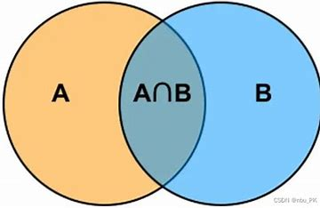
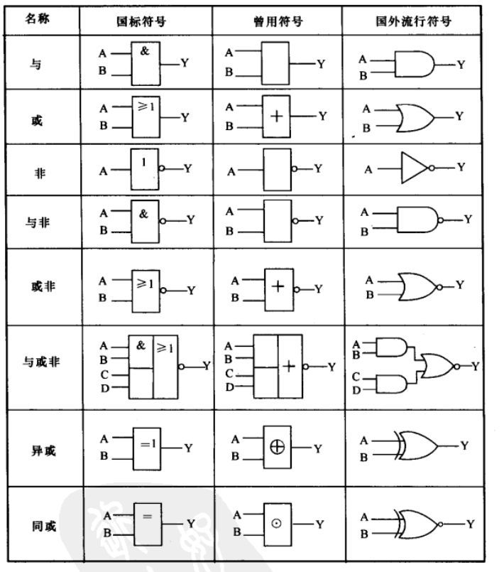
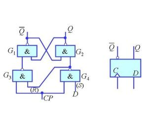

# 计算机科学简介（下）

## 电路模型

&emsp;&emsp;能够计算所有图灵机可计算函数的计算体系是**图灵完备**$^*$的。由于状态控制器和纸带上的内容必须要有变化（内存大小固定的情况下 $\Gamma$ 只有一种字符的图灵机不能用！除非能移动右端点的界限。），因此实现图灵机的元器件至少要有两种状态。最早的计算机是机械结构的，而现在，我们有**电路**这种更加经济和高效的实现方式。

### 1.布尔代数初步

&emsp;&emsp;既然我们选择了具有两种状态的电路实现，那就不可避免地要讨论二进制下的各种数学运算。在数学上，二进制数除了可以进行常规加减乘除等运算，$0$ 和 $1$ 还经常用来表示“真”和“假”这两个概念，仅能取值为整数 $0$ 或是 $1$ 的变量我们称为**布尔变量**，$0$ 和 $1$ 本身被称为**布尔常量**。它们之间可以进行**逻辑运算**来得到新的布尔值，自然也可以像平常定义函数一样定义**布尔函数**。
&emsp;&emsp;最基础的逻辑运算一般被认为有三种：**与**，**或**，**非**。
&emsp;&emsp;与运算又被称为逻辑乘，因为它起到了类似于集合交集的效果。布尔变量 $A$ 和 $B$ 的与记作 $A\cdot B$ ，也可以像平常写乘号一样省略，写作 $AB$。布尔函数 $f(A,B)=AB$ 的值为 $1$ 当且仅当 $A,B$ 的真值同时为 $1$；否则为 $0$.
&emsp;&emsp;或运算又被称为逻辑加，因为它起到了类似于集合并集的效果。布尔变量 $A$ 和 $B$ 的与记作 $A + B$。布尔函数 $f(A,B)=A+B$ 的值为 $1$ 当且仅当 $A,B$ 的真值至少一个为 $1$；否则为 $0$.
&emsp;&emsp;非运算是单目运算，它会把一个布尔变量的值取反。对变量 $A$ 取反被记作 $\overline{A}$，读作“非$A$”.
&emsp;&emsp;**韦恩图**是研究布尔代数的重要工具，它可以形象地展示一个逻辑表达式。

&emsp;&emsp;我们还可以为一个布尔函数写出**真值表**，这张表格列出了自变量的所有取值和对应的函数值。两个函数是相等的当且仅当它们的真值表相等。以下是与门的真值表：
A     | B | AB 
:-: | :-: | :-:
 0  |  0  |  0
 0  |  1  |  0
 1  |  0  |  0
 1  |  1  |  1

>试试看？
>①用韦恩图和真值表说明 $\overline{A+B}=\overline{A}\space\overline{B}$，$\overline{AB}=\overline{A}+\overline{B}$，这两条恒等式被称为德摩根律。
>②用“与”和“非”运算表示“或”运算。
>③将布尔函数 $f(A,B)=A\overline{B}+\overline{A}B$ 用“与”和“非”运算表示，然后用韦恩图表示它。和之前提到的或运算不同，举例说明为什么这个运算叫做“异或”。提示：异或的英语是exclusive OR，简写作XOR.

&emsp;&emsp;事实上，“与非”运算 $f(A,B)=\overline{AB}$ 对所有逻辑表达式是完备的（注意到 $\overline{A}=\overline{AA}$），也就是说，我们可以只用与非这一种运算来表示任意的逻辑表达式。这也说明为什么很多硬件实验室只需要采购一种价格低廉的与非门就能做实验了。

### 2.逻辑门与组合逻辑电路
&emsp;&emsp;在电路中，我们用低电平（压）和高电平（压）来分别表示 $0$ 和 $1$。这篇文章并不会具体展开某个逻辑门内部是如何实现的，如果有读者对这部分内容感兴趣，可以去了解一下**二极管**和**三极管**的工作原理。
&emsp;&emsp;电路由导线和各类门组成。电路的一端有输入高电平或是低电平的接口，然后输入信号被导线送入逻辑门进行运算。而可以接受 $01$ 字符串输入的，有着导线、逻辑门的有限规模的无环电路被称为**组合逻辑电路**。电路常用符号 $C$ 来表示，因为它的英语单词是circuit.
&emsp;&emsp;一些常见的逻辑运算使用的电路符号由下图表示：

>试试看？
>①用基础逻辑运算门搭建异或电路。
>②设计电路，它完成运算 $f(A,B,C)=A\space\overline{B}\space\overline{C}+\overline{A}\space B\space\overline{C}+\overline{A}\space\overline{B}\space C$，是交通灯的所有合法状态。
>③尝试搭建一个两位数加法器。

&emsp;&emsp;现在我们要讨论逻辑电路的计算能力。如果组合逻辑电路能计算所有可计算函数，那么它就是图灵完备的。
&emsp;&emsp;先考虑用图灵机模拟组合逻辑电路的简单情况，我们只需要像往常一样构造一个模拟电路的判定器就可以了。

>试试看？
>①设计一个图灵机 $M$ ，它判定语言 $L=\{<C_n>|C_n$是具有 $n$ 比特输入的组合逻辑电路$\}$ ，并且它可以模拟电路的运行，把最终的运行结果输出在纸带上。

&emsp;&emsp;接着，我们考虑用组合逻辑来模拟图灵机。显然，不包含回路的组合逻辑电路一定会停机，它不能模拟死循环，因此那些识别可识别但不可判定的语言的图灵机都不能用组合逻辑电路模拟。那关于判定器呢？
&emsp;&emsp;考虑某个判定器 $M$，它的输入串长度固定为 $n$。作为判定器，它的输出自然是 $0$ 或是 $1$，并且它一定停机。那么我们可以构造这样一个电路：先暴力枚举 $M$ 的所有 $2^n$ 种输入$\{s\}$，用 $M$ 计算其运行结果 $f(s)$，列出一张具有 $2^n$ 项的真值表，而真值表显然可以用组合逻辑电路表示。
&emsp;&emsp;电路一旦设计好，就不能增加或是减少输入的比特数量，因此对于同一个图灵机不同长度的输入需要很多种电路，把这些电路归为同一个集合，称为**电路族**：

>定义：集合 $C=\{C_i|i\in\mathbb{N}$$\}$ 被称为电路族，其中 $C_i$ 表示具有 $i$ 比特输入的电路。

&emsp;&emsp;分别为同一判定器的不同输入长度对应不同电路是不合理的，但是我们可以让同一电路族中，比特较多的电路能兼容包含比特较小的电路的所有功能，这样电路 $C_n$ 就能当作任意 $C_i,0\leq i<n$ 使用，高位比特在不使用的情况下好像不存在一样，这样的电路族我们称为**一致电路族**：

>定义：对于电路族 $C=\{C_i|i\in\mathbb{N}$$\}$，称 $C$ 是一致的当且仅当 $\Sigma =\{0,1\},\forall m,n\in\mathbb{N},m<n \rightarrow [ \forall s\in \Sigma^*,|s|\leq m \rightarrow C_m(x)=C_n(x) ]$，表明输入比特数较多的电路在较小的输入比特数上总能和输入比特数较小的电路运算结果一致。
>例：$C=\{C_i|\forall i \in \mathbb{N}$，$C_i$是 $i$ 位二进制加法器电路$ \}$ 是一个一致电路族，因为 $64$ 位加法器显然兼容 $32$ 位的。

&emsp;&emsp;如何构造一致电路族？我们将采用归纳法来构造：边界条件是 $n=0$ 时，无输入电路 $C_0$ 的真值容易用恒 $0$ 电路或是恒 $1$ 电路得到。假设我们已经构造出了电路 $C_{n-1}$，我们只需要分类讨论电路 $C_n$ 的第 $n$ 比特：如果是 $0$，则运行电路 $C_{n-1}$；否则查真值表构造输出。
&emsp;&emsp;这样构造出的一致电路族中的每个电路 $C_i$ 都在限制字符串长度不超过 $i$ 的情况下判定图灵机 $M$ 判定的语言 $L$.因此，一致电路族可计算的函数类与图灵机可计算的函数类完全相同，也就是说，组合逻辑电路等价于判定器。

### 3.（选读）触发器

&emsp;&emsp;组合逻辑无法模拟图灵机状态的变换，这是因为它无法记录信息。而一种带有循环的电路是可以记录信息的，被称为**触发器**.其中一种 $R-S$ 触发器的电路结构如下：

&emsp;&emsp;这个触发器的输出端一般认为是 $Q$，而 $\overline{Q}$ 通常作为辅助变量（虽然也可以作为输出）。这个触发器处于正常工作状态时，$Q$ 和 $\overline{Q}$ 的取值必须相反。注意图中的两个与非门，当输入端 $R$ 和 $S$ 同时为 $0$ 的时候，$Q$ 和 $\overline{Q}$ 都为 $1$ ，这就是非工作状态。当 $R$ 为 $1$ 而 $S$ 为 $0$ 时，$Q$ 的值强制为 $1$，而 $\overline{Q}$ 的值由 $R$ 和 $Q$ 确定为 $0$；当 $R$ 为 $0$，$S$ 为 $1$ 时情况是类似的，不过 $Q$ 和 $\overline{Q}$ 的值恰好相反。当 $R$ 和 $S$ 都是 $1$ 的时候，$Q$ 会保持原来的值不变，即为**锁存**。
&emsp;&emsp;为了防止 $R-S$ 触发器工作不正常，我们用导线和非门把 $R$ 和 $S$ 两端连在一起；接着 $S$ 端为 $0$ 的时候把 $Q$ 设置成 $1$ 有些反直觉，再加一个非门；最后再加一个开关用来检测是否改变寄存器当前的状态。于是，我们得到了 $D$ 触发器。

&emsp;&emsp;把 $CP$ 端接入**时钟发生器**，在 $CP=1$ 时就能记录 $D$ 此时刻的输入内容了，于是我们就有了好用的寄存器。准备一大堆寄存器，其中一些排成一排作为纸带，另一些编码成计数器作为读写头和状态控制器，这下就能完全模拟图灵机了！具体的**时序逻辑电路**设计请移步课程计算机组成与设计。

## 计算复杂性

&emsp;&emsp;现在我们已经有了一个图灵机的实用模型了，但不同的图灵机运行步数和占用纸带格子数都不一样。我们需要一套方法来量化不同规模问题需要消耗的资源，并讨论什么样的问题有比较“有效”的算法。这正是**计算复杂性**所研究的问题。

### 1.渐进符号

&emsp;&emsp;一台图灵机从开始运行到停机一共经历了有限步过程，每一步都要消耗一个时间单位；读写头也扫过了有限多的格子，每一个格子就是一个单位的空间。不同的输入长度对应着不同的问题规模，因此量化时空复杂度的一个合理的思想是构造一个与输入规模 $n$ 相关的一个函数。

>定义：若 $M$ 是一个在所有输入上都停机的确定型图灵机，$M$ 的运行时间或者**时间复杂度**是一个函数 $f:\mathbb{N}\rightarrow\mathbb{N}$，$f(n)$ 是 $M$ 在所有长度为 $n$ 的输入上运行时所经过的最大步数。