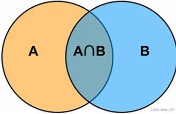
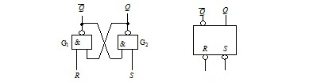
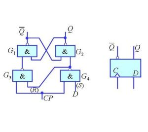

# 计算机科学简介（下）

## 电路模型

&emsp;&emsp;能够计算所有图灵机可计算函数的计算体系是**图灵完备**$^*$的。由于状态控制器和纸带上的内容必须要有变化（内存大小固定的情况下 $\Gamma$ 只有一种字符的图灵机不能用！除非能移动右端点的界限。），因此实现图灵机的元器件至少要有两种状态。最早的计算机是机械结构的，而现在，我们有**电路**这种更加经济和高效的实现方式。

### 1.布尔代数初步

&emsp;&emsp;既然我们选择了具有两种状态的电路实现，那就不可避免地要讨论二进制下的各种数学运算。在数学上，二进制数除了可以进行常规加减乘除等运算，$0$ 和 $1$ 还经常用来表示“真”和“假”这两个概念，仅能取值为整数 $0$ 或是 $1$ 的变量我们称为**布尔变量**，$0$ 和 $1$ 本身被称为**布尔常量**。它们之间可以进行**逻辑运算**来得到新的布尔值，自然也可以像平常定义函数一样定义**布尔函数**。
&emsp;&emsp;最基础的逻辑运算一般被认为有三种：**与**，**或**，**非**。
&emsp;&emsp;与运算又被称为逻辑乘，因为它起到了类似于集合交集的效果。布尔变量 $A$ 和 $B$ 的与记作 $A\cdot B$ ，也可以像平常写乘号一样省略，写作 $AB$。布尔函数 $f(A,B)=AB$ 的值为 $1$ 当且仅当 $A,B$ 的真值同时为 $1$；否则为 $0$.
&emsp;&emsp;或运算又被称为逻辑加，因为它起到了类似于集合并集的效果。布尔变量 $A$ 和 $B$ 的与记作 $A + B$。布尔函数 $f(A,B)=A+B$ 的值为 $1$ 当且仅当 $A,B$ 的真值至少一个为 $1$；否则为 $0$.
&emsp;&emsp;非运算是单目运算，它会把一个布尔变量的值取反。对变量 $A$ 取反被记作 $\overline{A}$，读作“非$A$”.
&emsp;&emsp;**韦恩图**是研究布尔代数的重要工具，它可以形象地展示一个逻辑表达式。

&emsp;&emsp;我们还可以为一个布尔函数写出**真值表**，这张表格列出了自变量的所有取值和对应的函数值。两个函数是相等的当且仅当它们的真值表相等。以下是与门的真值表：
A     | B | AB 
:-: | :-: | :-:
 0  |  0  |  0
 0  |  1  |  0
 1  |  0  |  0
 1  |  1  |  1

>试试看？
>①用韦恩图和真值表说明 $\overline{A+B}=\overline{A}\space\overline{B}$，$\overline{AB}=\overline{A}+\overline{B}$，这两条恒等式被称为德摩根律。
>②用“与”和“非”运算表示“或”运算。
>③将布尔函数 $f(A,B)=A\overline{B}+\overline{A}B$ 用“与”和“非”运算表示，然后用韦恩图表示它。和之前提到的或运算不同，举例说明为什么这个运算叫做“异或”。提示：异或的英语是exclusive OR，简写作XOR.

&emsp;&emsp;事实上，“与非”运算 $f(A,B)=\overline{AB}$ 对所有逻辑表达式是完备的（注意到 $\overline{A}=\overline{AA}$），也就是说，我们可以只用与非这一种运算来表示任意的逻辑表达式。这也说明为什么很多硬件实验室只需要采购一种价格低廉的与非门就能做实验了。
&emsp;&emsp;拓展：与非门价钱便宜似乎是由 MOS 晶体管的原理导致的，正负栅极管拼在一起只能制造出与非门，与门还要自己和自己取个与非，相当麻烦且耗材。这也是很多数电教科书上喜欢用反逻辑，把低电平当作 $1$ 的缘故。

### 2.逻辑门与组合逻辑电路
&emsp;&emsp;在电路中，我们用低电平（压）和高电平（压）来分别表示 $0$ 和 $1$。这篇文章并不会具体展开某个逻辑门内部是如何实现的，如果有读者对这部分内容感兴趣，可以去了解一下**二极管**和**三极管**的工作原理。
&emsp;&emsp;电路由导线和各类门组成。电路的一端有输入高电平或是低电平的接口，然后输入信号被导线送入逻辑门进行运算。而可以接受 $01$ 字符串输入的，有着导线、逻辑门的有限规模的无环电路被称为**组合逻辑电路**。电路常用符号 $C$ 来表示，因为它的英语单词是circuit.
&emsp;&emsp;一些常见的逻辑运算使用的电路符号由下图表示：

>试试看？
>①用基础逻辑运算门搭建异或电路。
>②设计电路，它完成运算 $f(A,B,C)=A\space\overline{B}\space\overline{C}+\overline{A}\space B\space\overline{C}+\overline{A}\space\overline{B}\space C$，是交通灯的所有合法状态。
>③尝试搭建一个两位数加法器。

&emsp;&emsp;现在我们要讨论逻辑电路的计算能力。如果组合逻辑电路能计算所有可计算函数，那么它就是图灵完备的。
&emsp;&emsp;先考虑用图灵机模拟组合逻辑电路的简单情况，我们只需要像往常一样构造一个模拟电路的判定器就可以了。

>试试看？
>①设计一个图灵机 $M$ ，它判定语言 $L=\{<C_n>|C_n$是具有 $n$ 比特输入的组合逻辑电路$\}$ ，并且它可以模拟电路的运行，把最终的运行结果输出在纸带上。

&emsp;&emsp;接着，我们考虑用组合逻辑来模拟图灵机。显然，不包含回路的组合逻辑电路一定会停机，它不能模拟死循环，因此那些识别可识别但不可判定的语言的图灵机都不能用组合逻辑电路模拟。那关于判定器呢？
&emsp;&emsp;考虑某个判定器 $M$，它的输入串长度固定为 $n$。作为判定器，它的输出自然是 $0$ 或是 $1$，并且它一定停机。那么我们可以构造这样一个电路：先暴力枚举 $M$ 的所有 $2^n$ 种输入$\{s\}$，用 $M$ 计算其运行结果 $f(s)$，列出一张具有 $2^n$ 项的真值表，而真值表显然可以用组合逻辑电路表示。
&emsp;&emsp;电路一旦设计好，就不能增加或是减少输入的比特数量，因此对于同一个图灵机不同长度的输入需要很多种电路，把这些电路归为同一个集合，称为**电路族**：

>定义：集合 $C=\{C_i|i\in\mathbb{N}$$\}$ 被称为电路族，其中 $C_i$ 表示具有 $i$ 比特输入的电路。

&emsp;&emsp;分别为同一判定器的不同输入长度对应不同电路是不合理的，但是我们可以让同一电路族中，比特较多的电路能兼容包含比特较小的电路的所有功能，这样电路 $C_n$ 就能当作任意 $C_i,0\leq i<n$ 使用，高位比特在不使用的情况下好像不存在一样，这样的电路族我们称为**一致电路族**：

>定义：对于电路族 $C=\{C_i|i\in\mathbb{N}$$\}$，称 $C$ 是一致的当且仅当 $\Sigma =\{0,1\},\forall m,n\in\mathbb{N},m<n \rightarrow [ \forall s\in \Sigma^*,|s|\leq m \rightarrow C_m(x)=C_n(x) ]$，表明输入比特数较多的电路在较小的输入比特数上总能和输入比特数较小的电路运算结果一致。
>例：$C=\{C_i|\forall i \in \mathbb{N}$，$C_i$是 $i$ 位二进制加法器电路$ \}$ 是一个一致电路族，因为 $64$ 位加法器显然兼容 $32$ 位的。

&emsp;&emsp;如何构造一致电路族？我们将采用归纳法来构造：边界条件是 $n=0$ 时，无输入电路 $C_0$ 的真值容易用恒 $0$ 电路或是恒 $1$ 电路得到。假设我们已经构造出了电路 $C_{n-1}$，我们只需要分类讨论电路 $C_n$ 的第 $n$ 比特：如果是 $0$，则运行电路 $C_{n-1}$；否则查真值表构造输出。
&emsp;&emsp;这样构造出的一致电路族中的每个电路 $C_i$ 都在限制字符串长度不超过 $i$ 的情况下判定图灵机 $M$ 判定的语言 $L$.因此，一致电路族可计算的函数类与图灵机可计算的函数类完全相同，也就是说，组合逻辑电路等价于判定器。

### 3.（选读）触发器

&emsp;&emsp;组合逻辑无法模拟图灵机状态的变换，这是因为它无法记录信息。而一种带有循环的电路是可以记录信息的，被称为**触发器**.其中一种 $R-S$ 触发器的电路结构如下：

&emsp;&emsp;这个触发器的输出端一般认为是 $Q$，而 $\overline{Q}$ 通常作为辅助变量（虽然也可以作为输出）。这个触发器处于正常工作状态时，$Q$ 和 $\overline{Q}$ 的取值必须相反。注意图中的两个与非门，当输入端 $R$ 和 $S$ 同时为 $0$ 的时候，$Q$ 和 $\overline{Q}$ 都为 $1$ ，这就是非工作状态。当 $R$ 为 $1$ 而 $S$ 为 $0$ 时，$Q$ 的值强制为 $1$，而 $\overline{Q}$ 的值由 $R$ 和 $Q$ 确定为 $0$；当 $R$ 为 $0$，$S$ 为 $1$ 时情况是类似的，不过 $Q$ 和 $\overline{Q}$ 的值恰好相反。当 $R$ 和 $S$ 都是 $1$ 的时候，$Q$ 会保持原来的值不变，即为**锁存**。
&emsp;&emsp;为了防止 $R-S$ 触发器工作不正常，我们用导线和非门把 $R$ 和 $S$ 两端连在一起；接着 $S$ 端为 $0$ 的时候把 $Q$ 设置成 $1$ 有些反直觉，再加一个非门；最后再加一个开关用来检测是否改变寄存器当前的状态。于是，我们得到了 $D$ 触发器。

&emsp;&emsp;把 $CP$ 端接入**时钟发生器**，在 $CP=1$ 时就能记录 $D$ 此时刻的输入内容了，于是我们就有了好用的寄存器。准备一大堆寄存器，其中一些排成一排作为纸带，另一些编码成计数器作为读写头和状态控制器，这下就能完全模拟图灵机了！具体的**时序逻辑电路**设计请移步课程计算机组成与设计。

## 计算复杂性

&emsp;&emsp;现在我们已经有了一个图灵机的实用模型了，但不同的图灵机运行步数和占用纸带格子数都不一样。我们需要一套方法来量化不同规模问题需要消耗的资源，并讨论什么样的问题有比较“有效”的算法。这正是**计算复杂性**所研究的问题。

### 1.渐进符号

&emsp;&emsp;一台图灵机从开始运行到停机一共经历了有限步过程，每一步都要消耗一个时间单位；读写头也扫过了有限多的格子，每一个格子就是一个单位的空间。不同的输入长度对应着不同的问题规模，因此量化时空复杂度的一个合理的思想是构造一个与输入规模 $n$ 相关的一个函数。

>定义：若 $M$ 是一个在所有输入上都停机的确定型图灵机，$M$ 的运行时间或者**时间复杂度**是一个函数 $f:\mathbb{N}\rightarrow\mathbb{N}$，$f(n)$ 是 $M$ 在所有长度为 $n$ 的输入上运行时所经过的最大步数。
>定义：若 $M$ 是一个在所有输入上都停机的确定型图灵机，$M$ 的运行时间或者**空间复杂度**是一个函数 $f:\mathbb{N}\rightarrow\mathbb{N}$，$f(n)$ 是 $M$ 在所有长度为 $n$ 的输入上扫描带子方格的最大数。

&emsp;&emsp;比如在一个规模为 $n$ 的比较排序算法中，我们一共做了 $\frac{n*(n-1)}{2}=\frac{n^2}{2}-\frac{n}{2}$ 次比较。在 $n$ 的规模很大的时候，我们可以忽略所有的低阶项以及无关紧要的常数，因此这个算法的时间复杂度是平方级的。为了把这些函数分类，形式化地，我们可以定义一个表示这种关系的符号，称为**渐进符号**，其中我们用**大 $O$ 记法**来表示 $f(n)$ 的一个上界：

>定义：设 $f$ 和 $g$ 是两个函数满足 $f,g:\mathbb{N}\rightarrow \mathbb{R^+}$，$f(n)=O(g(n))$ 当且仅当存在正整数 $c$ 和 $n_0$，使得 $\forall n \geq n_0$ 满足 $f(n)\leq cg(n)$。
>$f(n)=O(g(n))$ 称 $g(n)$ 是 $f(n)$ 的一个渐进上界。

&emsp;&emsp;类似地，我们可以定义渐进下界 $\Omega$：

>定义：设 $f$ 和 $g$ 是两个函数满足 $f,g:\mathbb{N}\rightarrow \mathbb{R^+}$，$f(n)=\Omega(g(n))$ 当且仅当存在正整数 $c$ 和 $n_0$，使得 $\forall n \geq n_0$ 满足 $f(n)\geq cg(n)$。
>$f(n)=\Omega(g(n))$ 称 $g(n)$ 是 $f(n)$ 的一个渐进下界。

&emsp;&emsp;最后，我们可以定义渐进相等 $\Theta$：

>定义：设 $f$ 和 $g$ 是两个函数满足 $f,g:\mathbb{N}\rightarrow \mathbb{R^+}$，$f(n)=\Theta(g(n))$ 当且仅当 $f(n)=O(g(n))$ 且 $f(n)=\Omega(g(n))$

&emsp;&emsp;如何找到一个上界或是下界？我们在微积分课上有学过高阶无穷小和等价无穷小的概念。

>定理：设 $f$ 和 $g$ 是两个函数满足 $f,g:\mathbb{N}\rightarrow \mathbb{R^+}$，$f(n)=O(g(n))$ 当且仅当极限 $\lim\limits_{n\rightarrow\infty} \frac{f(n)}{g(n)}=0$ 或 $c\in \mathbb{R^+}$.

&emsp;&emsp;这样对于大多数初等函数我们都可以估计它们的上下界。

>试试看？
>①证明 $\forall k>0,\ln n = O(n^k)$
>②证明 $\forall k,n^k=O(n^{\ln k})$
>③证明 $max(n,m)=\Theta(n+m)$
>④若函数 $e(n)=O(f(n))$，$g(n)=O(h(n))$，证明 $e(n)g(n)=O(f(n)h(n))$

### 2.分析算法

&emsp;&emsp;将函数分类后，我们可以开始给图灵机——也就是算法——分类了。

>定义：令 $t:\mathbb{N}\rightarrow\mathbb{R^+}$ 是一个函数。定义**时间复杂性类** $TIME(t(n))$ 为由 $O(t(n))$ 时间的单带图灵机判定的所有语言的集合。

&emsp;&emsp;举个例子，上一篇文章中判定 $L=\{(00)^*\}$，即含有偶数个 $0$ 的字符串的判定器 $M$，它的时间复杂度是 $O(n)$的，因此 $L\in TIME(n)$。

>试试看？
>①我们在上一篇文章的习题中构造过一个判定语言 $L=\{w\#w|w\in\{0,1\}^*\}$ 的判定器。它的时间复杂度是多少？尝试用双带图灵机设计时间复杂度更低的算法。
>②计算加法函数 $f(x,y)=x+y$ 的时间复杂度是多少？平常写代码（C++、Python或任何常见的高级语言）的时候的普通加法时间复杂度又是多少？高精度加法呢？这两个问题一共说明了什么？

&emsp;&emsp;不同机器上运行效果类似的算法所需的资源（时空复杂度）是不同的，抛开机器种类谈论复杂度的行为都是在耍流氓！
&emsp;&emsp;一个有趣的结论是对于任意一个多带图灵机，总是存在一个时间复杂度为它的平方级的单带图灵机模拟它，以至于我们接下来在讨论 $P$ 与 $NP$ 问题的时候，总是可以用多带图灵机设计多项式复杂度算法，而不限于单带图灵机。

>命题：设函数 $t(n)\geq n$，则每一个 $t(n)$ 时间的 $\forall k \in \mathbb{N} \cap [2,\infty) $ 带图灵机 $M_k$ 都存在某个 $O(t^2(n))$ 时间的单带图灵机 $M$ 与之等价。
>证明：考虑上篇文章中我们构造出的模拟多带图灵机 $M_k$ 的单带图灵机 $M$，它把 $M_k$ 所有纸带的内容都放到唯一一条纸带上，并且在 $M_k$ 某些纸带扩张空间的时候，$M$ 会把扩张空间之后的所有字符都往后移动。
>&emsp;&emsp;$M$ 如果想要模拟 $M_k$，它利用在纸带上添加 $\dot{}$ 号来标记 $M_k$ 各个读写头的位置。模拟 $M_k$ 单步的过程分为两步：①扫过整个纸带，记下 $k$ 个 $\dot{}$ 的位置以算出接下来每个读写头的操作；②再次扫过纸带，修改 $k$ 个 $\dot{}$ 的符号并移动 $\dot{}$，如有必要，需要扩张空间。
>&emsp;&emsp;最坏情况下，$M_k$ 的 $k$ 个读写头都要一直向右移动扩张空间，$M$ 模拟扩张和两次扫描纸带的最坏时间是 $k^2*t(n)+2k*t(n)$，因为在 $M_k$ 所有纸带都扩张的情况下，纸带内容长度之和最大为 $k*t(n)$，$M$ 为其中一个纸带扩张空间最坏需要几乎扫过整条纸带，一轮模拟最多扩张全部 $k$ 条纸带的空间，因此得到了 $k^2*t(n)$ 这一项；再加上算法中自带的两次扫描就得到了上面的式子。
>&emsp;&emsp;我们求出了 $M$ 模拟 $M_k$ 单步运行的所需最坏时间，而 $M_k$ 会运行 $t(n)$ 步，于是 $M$ 是一个运行时间 $t'=t(n)*(k^2*t(n)+2k*t(n))=O(t^2(n))$ 的单带图灵机。注意命题有个约束 $t(n)\geq n$ 是为了让 $M_k$ 至少运行 $n$ 步来读完整个输入。

&emsp;&emsp;至于非确定型图灵机和单带图灵机时间复杂度之间的关系，我们已经在上一篇文章中提到过，我们不加证明地简要回顾一下这个结论：

>命题：设函数 $t(n)\geq n$，则每一个 $t(n)$ 时间的 非确定型图灵机 $M_{NTM}$ 都存在某个 $2^{O(t(n))}$ 时间的单带图灵机 $M$ 与之等价。

### 3.P 与 NP

&emsp;&emsp;时间复杂度类中，有两个特别重要的类，分别被称为 $P$ 类和 $NP$ 类。
&emsp;&emsp;运行时间的多项式差异一般被认为是较小的，而指数差异是较大的。考虑一个多项式函数 $f(n)=n^3$ 和一个指数函数 $g(n)=2^n$，$n=1000$ 是十分常见的输入规模。$f(1000)=10^9$ 的运算次数可以在大多数现代个人微型计算机上用很短的时间完成；而 $g(1000)=2^{1000}$ 比整个宇宙的原子数还要大得多。
&emsp;&emsp;因此我们常用是否有多项式时间的算法来衡量是否能够有效求解问题，所有合理的确定型计算模型都是**多项式等价的**，从而引出 $P$ 类问题的定义：

>定义： $P$ 是确定型单带图灵机在多项式时间内可判定的语言类，即：
    $$P=\bigcup_{k\in\mathbb{N}}TIME(n^k)$$

&emsp;&emsp;$P$大致对应于计算机上实际可解的那一类问题。虽然形如 $n^{100}$ 这样的复杂度可能没有实际应用价值，但这表明我们掌握了这个问题的某种特质，通常复杂度还能继续降低。

>试试看？
>①证明图联通问题是 $P$ 的。即证明：$L=\{<G>|G$是一张无向图，且 $<G>$ 是一个有效的无向图的编码$\} \in P$
>②证明：二进制四则运算都是 $P$ 的。
>③证明：给一个二进制非负整数开根号下取整的运算是 $P$ 的，即存在一个单带图灵机在 $P$ 时间内计算函数 $f(x)=\lfloor\sqrt{(x)}\rfloor,x\in\mathbb{N}$。
>④素因子分解问题是一个判定问题：$L=\{<m,l>|l\in\mathbb{N}\wedge l<m;\exist p,q\in \mathbb{N}\cap[2,m-1] \wedge m=pq\wedge p<l\}$，即对于给定的合数 $m$ 和小于 $m$ 的正整数 $l$，$m$ 是否含有比 $l$ 小的非平凡因子？多数人认为这个问题恐怕不是 $P$ 的。证明当且仅当 $L\in P$ 时，求解将 $m$ 分解质因数是 $P$ 的。

&emsp;&emsp;某些问题*可能*并没有多项式复杂度的解法，或者相关的解法尚未被发现，或者它们固有地难以计算。其中一个经典的问题被称为**哈密顿路径**问题。
&emsp;&emsp;一张有向图 $G=<V,E>$ 的哈密顿路径是指每个节点恰好通过一次的有向路径。考虑这样一个问题：给定一张具有 $n$ 个点的有向图 $G$ ，询问它是否存在一条哈密顿路径。

&emsp;&emsp;一种简单粗暴的算法是枚举所有 $n!$ 种全排列，表示经过节点的顺序，检查这个顺序是不是一条合法路径，这样时间复杂度显然是阶乘级的；但如果我们枚举了一条路径，很容易就可以在多项式时间内检验这个路径的正确性，这种性质被称为**多项式可验证性**。
&emsp;&emsp;验证方案的正确性显然需要一个过程，也就是算法，因此我们可以单独设计一个图灵机，它验证方案的正确性，这个图灵机被称为**验证机**：

>定义：语言 $L$ 的验证机是一个图灵机 $V$，满足
    $L=\{s|$对某个字符串$c$，$V$ 接受$<s,c>\}$
>&emsp;&emsp;如果 $V$ 在关于 $s$ 的长度的多项式时间内运行，则称 $V$ 为**多项式时间验证机**。若一个语言 $L$ 有一个多项式时间的验证机，则称 $L$ 为**多项式可验证的**。此时对于使得 $s$ 通过验证的 $c$ 称作 $s$ 属于集合 $L$ 的一个**证据**。

&emsp;&emsp;举个例子，在判定哈密顿路径问题中，$L$ 是所有具有哈密顿路径的图的编码的集合，$s$ 是其中一张图的编码，$c$ 是一个节点的排列，$V$ 是检验 $c$ 是否是 $s$ 的一条哈密顿路径，一条合法的哈密顿路径即为一个证据。
&emsp;&emsp;并且我们可以据此定义 $NP$ 问题：

>定义：$NP$ 是具有多项式时间验证机的语言类。即，$L\in NP$ 当且仅当存在一个多项式运行时间的判定器 $V$ 是 $L$ 的验证机。

&emsp;&emsp;接下来是一个很重要的结论，考虑非确定型图灵机的功能，它很适合用来枚举搜索空间的所有方案。如果语言 $L$ 的一台验证机 $V\in P$，即 $\exist k,V=O(n^k)$，我们可以非确定性地枚举所有长度为 $n^k$ 的字符串 $c$ ，然后运行 $V$ 即可在多项式时间内判定语言 $L$。因此我们可以得到 $NP$ 问题的第二种定义：

>定理：一个语言 $L\in NP$，当且仅当存在一个多项式运行时间的非确定性图灵机 $M$ 判定它。
>证明：充分性，已知 $L\in NP$，则它存在一个验证机 $V$，它的运行时间为 $n^k$。则可以构造一个 $NTM$ $M_{NTM}$ 作为它的判定器：
>$M=“$ 对于长度为 $n$ 的输入 $s$：
>&emsp;&emsp;① 非确定地枚举长度不超过 $n^k$ 的字符串 $c$。
>&emsp;&emsp;② 在输入 $<s,c>$ 上运行 $V$。
>&emsp;&emsp;③ 如果 $V$ 接受，则*接受*；否则*拒绝*。$”$
>&emsp;&emsp;必要性，已知存在一个运行时间是多项式的 $NTM$ $M_{NTM}$ 是$L$ 的判定器，则可以为 $L$ 构造一个多项式运行时间的验证机 $V$：
>$V=“$ 对于输入 $<s,c>$：
>&emsp;&emsp;①在输入 $s$ 上模拟 $M_{NTM}$，并且只进入表示 $c$ 的分支。具体做法是把 $c$ 的每个符号都看作某几步在 $\delta_0$ 和 $\delta_1$ 的选择。不能枚举所有分支，这样才能确保运行时间是多项式的。
>&emsp;&emsp;②如果 $M_{NTM}$ 的当前分支接受，则**接受**；否则**拒绝**。$”$

&emsp;&emsp;现在，我们用两种等价的方法定义了 $NP$ 问题，其中第二种定义方法很容易得到 $P\subseteq NP$ 的结论。证明很简单，只需要让非确定性的两个转移函数相等就能模拟确定型图灵机。至于 $P = NP$ 这个命题则是否成立则作为一个尚未解决的问题，许多研究者在此投入了大量的时间精力试图证实或是证伪这个结论。目前已知最好的判定语言是 $NP$ 的确定型算法需要消耗指数级时间，即用单带图灵机模拟非确定型图灵机的朴素算法：
$$ NP \subseteq EXPTIME = \bigcup_{k\in\mathbb{N}}TIME(2^{n^k}) $$
&emsp;&emsp;拓展：我们注意到拿着证据检验一个字符串 $s\in L,L\in NP$ 是容易的，但证明 $s\notin L$ 似乎困难的多，因为我们试图证明一个不存在的东西不存在。因此有些教科书会提到 $coNP$ 类，定义为 $coNP=\{\Sigma^*-L|L\in NP\}$，即每个出现在 $coNP$ 类的语言都能在 $NP$ 中找到它的补集，反之亦然。

>试试看？
>①设计一个多项式时间判定哈密顿路径问题的 $NTM$。
>②无向图 $G$ 中的一个 $k$ 团，是指 $G$ 的一个具有 $k$ 个节点的完全子图。证明判定一张图是否存在一个 $k$ 团是 $NP$ 的，可以分别从多项式可验证性和非确定型图灵机两个角度给出不同的证明。
>③中国象棋风靡全球。考虑一个红方胜利的对局记录，它是中国象棋先手必胜的一个证据吗？为什么？简要讨论求解攻王类棋类问题的复杂性。

### 4. 归约与 NP 完全性

&emsp;&emsp;$NP$ 问题中有一类特殊的问题，一旦高效地解决了这些问题中的任何一个，就可以高效地解决任何一个 $NP$ 问题，虽然这听上去很不可思议。
&emsp;&emsp;当我们拿到一个全新的问题后，一个常见的思路是把它转化为另一些已经解决的问题。这个技巧，在数学或是计算机科学中被称为**归约**。能够把问题 $A$ 转化为问题 $B$ 至少说明解决 $A$ 的难度**不大于** $B$，因为只要把 $B$ 解决了，$A$ 就能得到解决，反过来却不行。我们可以定义映射可归约性如下：

>定义：语言 $A$ 映射可归约到语言 $B$，当且仅当存在一个可计算函数 $f:\Sigma^* \rightarrow \Sigma^*$ 满足 $\forall s\in A$ 当且仅当 $f(s) \in B$，记作 $A\leq_m B$。

&emsp;&emsp;如果 $B$ 是可判定的，那么我们可以很容易地构造一个 $A$ 的判定器。注意映射可归约中的当且仅当这个条件，它把 $A$ 的成员的判定问题转化为 $B$ 的成员判定问题。
>命题：如果语言 $A$ 映射可归约到语言 $B$，且 $B$ 是可判定语言，则 $A$ 是可判定语言。
>证明：$A$ 可映射到语言 $B$，则存在一个可计算函数 $f:\Sigma^* \rightarrow \Sigma^*$，它将任何属于 $A$ 的成员转化为 $B$ 的成员，反之亦然。由于 $B$ 是可判定语言，故其存在一个判定器 $M_B$。据此构造 $A$ 的一个判定器 $M_A$ 如下：
>&emsp;&emsp;$M_A=“$ 以字符串 $s$ 为输入：
>&emsp;&emsp;①计算 $f(s)$。
>&emsp;&emsp;②在 $f(s)$ 上运行 $M_B$。
>&emsp;&emsp;③如果 $M_B$ 接受，则*接受*；否则*拒绝*。$”$

&emsp;&emsp;接着我们引入复杂度限制，进一步定义多项式时间可计算函数，然后接着定义多项式可归约：

>定义：函数 $f:\Sigma^*\rightarrow\Sigma^*$ 是一个**多项式可计算函数**，当且仅当存在一个多项式时间图灵机 $M$ ，使得对于任意输入字符串 $s$ 都停机，且最后只有 $f(s)$ 停留在带子上。
>定义：语言 $A$ 多项式时间映射可归约到语言 $B$，当且仅当存在一个多项式时间可计算函数 $f:\Sigma^* \rightarrow \Sigma^*$ 满足 $\forall s\in A$ 当且仅当 $f(s) \in B$，记作 $A\leq_p B$。

&emsp;&emsp;如果对 $A$ 的输入到 $B$ 的输入的归约，以及对 $B$ 的成员判定都是多项式时间的，那么我们就存在一个多项式时间的判定器用于判定语言 $A$ 了。其证明和可判定性证明是完全类似的。

>命题：如果 $A\leq_p B$ 且 $B\in P$，则 $A \in P$。

&emsp;&emsp;现在我们可以讨论对 $NP$ 的归约了。如果任意 $NP$ 问题都能归约到某个问题上，我们就解决了所有的 $NP$ 问题。事实上，我们存在一类特殊的问题满足这些性质，它们被称为 $NP$ 难问题，或是 $NP-Hard$ 问题。高效解决这些问题至少不比高效解决任意一个 $NP$ 容易，因而得名。$NP-Hard$ 中还存在一些满足 $NP$ 定义的问题，它们被称作 $NP$ 完全问题，或是 $NPC$ 问题，这将是我们接下来讨论的重点。

>定义：如果语言 $B$ 满足 $NP$ 中的每个 $A$ 都能多项式时间可归约到 $B$，则 $B\in NP-Hard$。
>进一步地，如果额外满足 $B\in NP$，则 $B\in NPC$。

&emsp;&emsp;$NPC$ 问题当中，存在一个非常重要的问题，被称作 $SAT$ 问题。$SAT$ 问题指的是给定一个布尔函数 $\phi(x_1,x_2,x_3\dots ,x_n)$，求任意一个自变量取值的组合，使得 $\phi=1$。为了方便接下来的讨论，我们对布尔代数的一些内容进行进一步定义。
&emsp;&emsp;**文字**是单个布尔变量或是它的非。即，如果 $x$ 是布尔变量，则 $x$ 和 $\overline{x}$ 都是文字。**子句**是由若干个或运算 $+$ 连接起来的若干个文字，如 $x + \overline{y} + \overline{z}$。一个布尔代数表达式如果是由若干个与运算 $·$ 连接的若干子句组成，那么这个布尔表达式也被称为**合取范式**或是 **cnf 公式**。比如 $(\overline{x}+y)(\overline{y}+z)(\overline{z}+x)$ 就是一个合取范式。

>试试看？
>①设 $A,B,C$ 是三个布尔变量。证明两种分配律：$A+BC=(A+B)(A+C)$；$A(B+C)=AC+BC$。
>②证明：任何布尔代数式都能被变形为合取范式。（提示：结合德摩根律和分配律，按照表达式长度进行数学归纳。）

&emsp;&emsp;一旦有了第一个 $NP$ 完全问题，我们就可以从它出发，通过多项式时间归约得到其它 $NP$ 完全问题。下面我们要证明 $SAT$ 是 $NP$ 完全的，这个命题亦被称为**库克-列文定理**。我们有提到过逻辑电路是等价于判定器的这一事实，而逻辑电路是等价于布尔表达式的，因此可以用布尔表达式模拟判定器并不令人感到意外。
&emsp;&emsp;回想我们对格局的定义，它是<控制器状态，读写头位置，纸带内容>的三元组。事实上，我们可以用一个字符串来表示格局，形如：$c_1c_2c_3qc_4\dots c_{n^k}$。其中 $c_i\in \Gamma$，表示纸带上的符号； $q\in Q$ 的表示控制器的状态；而 $q$ 在字符串中的位置指示了读写头的位置，一般认为读写头正停留在 $q$ 之后一个字符的位置。
&emsp;&emsp;考虑判定某个 $NP$ 问题的，运行时间最大为 $n^k$ 的非确定性图灵机判定器 $M_{NTM}$，某个字符串被接受当且仅当存在一个计算分支接受它。也就是说，在这个接受分支存在一个格局序列，它的最后一个格局包含一个接受态。
&emsp;&emsp;这个判定器的运行时间最大为 $n^k$，说明判定器运行的格局序列长度不会超过 $n^k$，因此我们可以枚举每个格局的每个字符种类作为布尔变量，再对 $n^k$ 的字符串序列进行合法性检查，判断它是否是一个接受格局序列，从而完成到 $SAT$ 的归约。
>命题：$SAT\in NPC$。
>证明：证明 $SAT\in NP$ 是容易的，只需要非确定性地猜测每个布尔变量的值再代入原布尔函数验证即可。
>&emsp;&emsp;现在给定一个 $M_{NTM}$，我们要在多项式时间内输出一个布尔函数 $\phi$ 来完成归约。对于某个 $NP$ 问题的非确定型图灵机 $M_{NTM}=\{Q,\Sigma,\Gamma,\delta_0,\delta_1,q_0,q_{accepc},q_{reject}\}$，它在多项式时间内停机，设最大运行时间为 $n^k$。$M_{NTM}$ 接受输入 $s$ 当且仅当存在一个计算分支，它的格局序列长度不超过 $n^k$ 并以接受格局结束。
>&emsp;&emsp;现在给定一个 $M_{NTM}$，我们要在多项式时间内输出一个布尔函数 $\phi$ 来完成归约。
>&emsp;&emsp;设布尔变量 $x_{i,j,c}$ 表示第 $i$ 个格局中，第 $j$ 个字符是字符 $c$。其中，$c\in Q \cup \Gamma$，表示格局字符串中可能出现的字符，接下来我们用 $C=Q\cup \Gamma$ 替代它。由于 $M_{NTM}$ 会在 $n^k$ 时间内停机，单个格局的长度不会超过 $n+1$，因此 $j$ 的大小也不会超过 $n^k+1$。我们要多项式时间内计算一个表示 $M_{NTM}$ 是否接受字符串 $s$ 的函数 $\phi$，它是以下四个布尔表达式的乘积（与），分别表示四个约束：
>$$ \phi = \phi_{cell} \phi_{start} \phi_{move} \phi_{accept} $$
>&emsp;&emsp;我们逐一分析这四个约束：
>&emsp;&emsp;首先，每个格局字符串的每个位置必须唯一有一个字符。$\phi_{cell}$ 用于刻画这一点：
>$$ 
    \phi_{cell} =
    \prod_{1\leq i\leq n^k ,
    1\leq j\leq n^k +1} (\sum_{c\in C} x_{i,j,c})(\prod_{c,d\in C,c\not =d}(\overline{x_{i,j,c}}+\overline{x_{i,j,d}}))
$$
>&emsp;&emsp;枚举第 $i$ 个格局字符串的第 $j$ 个位置，它至少要有一个字符，且不得同时拥有两个字符。
>&emsp;&emsp;接着，第一个格局必须是初始格局。读写头应当位于图灵机的最左侧，即格局字符串的第一个位置。$\phi_{start}$ 完成这个任务：
>$$ \phi_{start}=x_{1,1,q_{start}}x_{1,2,s_1}x_{1,3,s_2}\dotsb x_{1,n^k+1,s_{n^k}} $$
>&emsp;&emsp;第三，格局之间的转移需要符合两个 $delta$ 所描述的规则。由于读写头只会读取当前格子的字符，还只会左右移动，因此一步格局变换最多影响到格局字符串三个相邻的字符：读写头当前对着的字符、读写头移动到的字符和读写头本身。因此检查格局上下转移是否合法，我们只需要考虑枚举所有当前格局相邻三个字符和下一个格局的相邻三个字符，检查这 $2 \times 3$ 的窗口是否符合转移规则。
>&emsp;&emsp;考虑转移规则 $(q_1,a,L)$，它对应六种合法转移情况：读写头在上排的三种位置、读写头在窗口左侧指向最左边的字符、读写头在窗口右侧即将移进窗口、以及最后一种读写头在远处，不影响这三个字符的情况。不论如何，一条规则可以生成至少一个六元组 $r=(a_{11},a_{12},a_{13},a_{21},a_{22},a_{23})$，一个窗口的字符合法只需要等于 $\delta_0$ 或 $\delta_1$ 中任意一条规则生成的六元组即为合法转移。把所有生成的六元组集中到一个集合 $R$ 中，因此 $\phi_{move}$ 可以被描述为：
$$ 
    \phi_{move} =
    \prod_{1\leq i < n^k ,
    1 < j < n^k + 1} \sum_{r\in R} (x_{i,j-1,r_{a_{11}}}x_{i,j,r_{a_{12}}}x_{i,j+1,r_{a_{13}}}x_{i+1,j-1,r_{a_{21}}}x_{i+1,j,r_{a_{22}}}x_{i+1,j+1,r_{a_{23}}}) 
$$
>&emsp;&emsp;最后，至少要存在一个接受格局，即满足 $\phi_{accept}$ 约束：
$$
    \phi_{accept} = \sum_{1\leq i\leq n^k , 
    1\leq j\leq n^k + 1} x_{i,j,q_{accept}}
$$
>&emsp;&emsp;于是我们完成了从一台 $NTM$ 到布尔表达式的归约。还差最后一步，证明这个归约是多项式时间的。
>&emsp;&emsp;首先我们考察布尔变量的数量。一共最多有 $n^k$ 个格局，每个格局字符串长度最多为 $n^k+1$，每个位置至多有 $|C|=|Q|+|\Gamma|$ 种字符可以填，总变量数量为 $(n^k+1)n^k|C|=O(n^{2k})$。这里我们只考虑与 $n$ 相关的部分，因此 $|C|$ 显然是常数。
>&emsp;&emsp;接着我们考虑布尔表达式 $\phi$ 的长度，四个部分可以分开考虑。$\phi_{cell}$ 中每个格局的每个位置都有只和 $|C|$ 相关的固定长度，因此是 $O(n^{2k})$ 的。$\phi_{start}$ 由初始格局描述，它的长度是 $n^k+1$ 的。$\phi_{move}$ 中包含不多于$6*(|\delta_0|+|\delta_1|)$ 数量的窗口条件六元组，单个条件的长度不超过六个文字，这部分是固定的，而窗口总数是 $O(n^{2k})$ 的，故 $\phi_{move}$ 的长度也是 $O(n^{2k})$ 的。$\phi_{accept}$ 对每个位置进行判断，也是 $O(n^{2k})$ 的。
>&emsp;&emsp;因此 $SAT\in NPC$。

&emsp;&emsp;综上所述，我们找到了一个能够将任意一个多项式运行时间的 $NTM$ 转化为多项式规模的布尔表达式的算法，完成了从任意 $NP$ 问题到 $SAT$ 问题的归约。我们终于证明了 $SAT$ 是 $NP$ 完全的！只要 $SAT\in P$，就能证明 $P=NP$！$SAT$ 是否确实是 $P$ 的，还等待着人们去探索。

>试试看？
>①在 $SAT$ 问题中，如果一个合取范式的所有子句都至多包含 $k$ 个文字，这个问题就被称为 $k-SAT$。证明 $2-SAT \in P$。
>②证明任意 $k-SAT$ 都能归约到 $3-SAT$。这个结论说明 $3-SAT$ 是 $NP$ 完全的。
>③考虑逆电路问题：给定一个组合逻辑电路，它读入一个 $01$ 串 $s$，并计算 $f(s)$，问是否存在一个 $s$，使得 $f(s)=1$。通过将 $SAT$ 问题双向地归约到它来证明它是 $NPC$ 的。这个结论说明使用图灵机反向破译包含不可逆操作的电路十分困难，而只包含可逆操作的量子计算或许充满了前途。

### 5.其它复杂性

&emsp;&emsp;到目前为止，我们着重介绍了两种时间复杂度类。受限于文章的篇幅，我们不能介绍所有时间或是空间复杂性类，包括**萨维奇定理**等有趣结论。我们仅仅简单提及一些比较重要的内容。
&emsp;&emsp;与 $P$ 类似，我们可以定义**多项式空间复杂度类** $PSAPCE$，它表示一台单带图灵机使用多项式空间完成计算。
&emsp;&emsp;时间复杂度在某种意义上限制了空间复杂度的上界：显然 $P \subseteq PSPACE$，因为每一步计算至多消耗一个单位的空间；亦不难证明 $NP \subseteq PSPACE$，只需要在计算某个分支后清空纸带就能做到空间复用。，
&emsp;&emsp;反过来，空间复杂度也能限制时间复杂度的上界：$PSPACE \subseteq EXPTIME$，这是因为如果一台 $PSPACE$ 空间的图灵机想要停机，就不能出现两个相同格局。空间为 $f(n)$ 的图灵机至多有 $|Q|\times f(n)(|Q|+|\Gamma|)^{f(n)} = O(f(n)2^{kf(n)})$ 种不同格局，因此当 $f(n)=n^k$ 时，即可证明 $PSPACE \subseteq EXPTIME$。
&emsp;&emsp;讨论对数时间复杂度没有意义，因为这样连输入都读不完，但我们可以讨论**对数空间复杂度类** $L$。比方说，某个由于某种原因只能读取的硬盘的空间比内存大得多，我们一次性只能把很少一部分内容搬进内存，这个时候使用少量内存进行大量计算就显得很有意义。考虑一个双带图灵机，第一条纸带上存放着输入，并且只能读取，不能修改；第二条纸带可以读写，但只能消耗等同于输入长度对数级的空间。一般来说，如果输入了 $n$ 个数，我们只能存储常数个数、指针或是计数器；输入常数个二进制数，就几乎不能使用内存了。
&emsp;&emsp;类似 $PSPACE \subseteq EXPTIME$，用同样的方法我们可以得到 $L \subseteq P$。
&emsp;&emsp;于是我们得到了一条集合包含关系的一条链：
$$L \subseteq P \subseteq NP \subseteq PSPACE \subseteq EXPTIME$$
&emsp;&emsp;已经有人证明了 $P \not ={EXPTIME}$ 和 $L \not ={PSPACE}$，这说明这条链上的至少一个包含关系是真包含，但目前没人知道具体是哪些！
&emsp;&emsp;（笔者暴论：空间和时间互相约束，$EXPTIME$ 时间复杂度应当被 $EXPSPACE$ 约束，$EXPSPACE$ 被 $EXPEXPTIME$ （自己编的）约束，以此类推形成指数塔的结构。这种每取一次指数就爆炸一次发生质变，像极了对无穷集合取幂集后它的势发生了剧变。）
&emsp;&emsp;正如我们在上一节中提到的，高效解决 $NP$ 问题很难；作为替代，我们可以为这些问题给出一个**近似算法**，比如我们之前在介绍概率型图灵机时提到的 Miller-Rabin 素性测试。
&emsp;&emsp;概率型图灵机并不总是能给出正确的结果，而是某个概率得到正确的结果。得到正确结果的概率如果小于 $\frac{1}{2}$，那还不如完全随机抛硬币地获取“答案”，因此这个概率应该大于 $\frac{1}{2}$。我们可以定义 $BPP$ 类：
>定义：一个语言 $L\in BPP$，当且仅当存在一个多项式时间的概率型图灵机 $PTM M$，对于输入 $x\in L$，它以 $\frac{2}{3}$ 概率接受 $x$；对于输入 $x\notin L$，它以 $\frac{2}{3}$ 概率拒绝 $x$。
&emsp;&emsp;如果每次运行这个算法得到正确的概率为 $p\geq\frac{1}{2}$，那我们可以对同样的输入运行多次该算法，然后以少数服从多数的原则进行投票得到最终结果，这样可以提高准确率。下面的定理不仅证明了同样的算法运行 $n$ 次准确率是收敛到 $1$ 的，还给出了收敛速率，因此定义 $BPP$ 中的准确率常数可以是介于 $\frac{1}{2}$ 和 $1$ 之间的任意常数。
>命题：设 $X_1,X_2,\dots,X_n$ 是一系列独立同分布的随机变量，每个变量以 $\frac{1}{2}+\epsilon$ 取值为 $1$，以 $\frac{1}{2}-\epsilon$ 取值为 $0$，则
$$ P(\sum_{i=1}^nX_i) \leq e^{-2\epsilon^2n}$$
>&emsp;&emsp;即这些变量的投票结果为 $0$ 的概率存在一个上界，被称作**切诺夫界**。
>证明：考虑任一包含至多 $\frac{n}{2}$ 个 $1$ 的序列，即投票失败的某个序列，由于 $\frac{1}{2}+\epsilon > \frac{1}{2}$，因此这个序列恰好包含 $\lfloor \frac{n}{2} \rfloor$ 个 $1$ 的时候出现的概率最大，因此我们可以作如下放缩：
$$
    P(X_1=x_1,\dots,X_n=x_n)\leq(\frac{1}{2}-\epsilon)^{\frac{n}{2}}(\frac{1}{2}+\epsilon)^{\frac{n}{2}}=\frac{(1-4\epsilon^2)^{\frac{n}{2}}}{2^n}
$$
>&emsp;&emsp;投票失败的情况不会超过总数 $2^n$ 种，因此：
$$
    P(\sum_{i=1}^nX_i)\leq 2^n \times 
    \frac{(1-4\epsilon^2)^{\frac{n}{2}}}{2^n} = (1-4\epsilon^2)^{\frac{n}{2}}
$$
&emsp;&emsp;最后使用在微积分会使用的一个放缩不等式 $1-x\leq e^{-x}$，得：
$$
    P(\sum_{i=1}^nX_i)\leq e^{-4s\epsilon^2n/2} = e^{-2s\epsilon^2n}
$$

&emsp;&emsp;因此我们增大随机算法运行次数，就能将错误率指数速率地降低。

### 6.信息论初步与可逆计算

&emsp;&emsp;最后，我们来讨论除了时间和空间以外的第三种资源——能量。数学上，我们往往会忽略能量的开销，但对于一个现实中的一台计算机，我们不能不考虑它运行时的耗能。
&emsp;&emsp;在讨论这个问题之前，我们得思考一下什么是信息。考虑一个盒子里面装着相同数量的红球和蓝球，你从中随机抽取一个，并用一根只能传输 $01$ 串的信号线来告诉我你抽到的颜色，显然，你只需要向我传输一个比特的信息；如果盒子里有八种颜色的球，你就需要向我传输三个比特。我一开始并不知道你摸的是什么颜色，而你向我传输的比特消除了这种不确定性，因此信息是用来消除不确定性的介质。盒子里球的颜色多的时候你需要向我传输更多的比特，也就是更大的信息量来消除不确定性。显然，你需要向我传输的比特数和盒子里球颜色的种类数的对数相关。假设球的颜色集合是 $\Omega$，那么装着相同数量的 $|\Omega|$ 种不同颜色球的盒子不确定性需要传输 $\log_{2}{|\Omega|}$ 个比特消除。这里的 $\Omega$ 是状态空间，每一种状态我们可以用一个正整数来表示，$\log_{2}{|\Omega|}$ 即为信息量。
&emsp;&emsp;如果盒子里装的全是红球，显然你甚至可以在摸球之前确定摸到的一定是红球，摸球观察的行为完全不能提供任何信息量；如果红球的数量很多，蓝球的数量很少，那你知道你大概率可以摸到红球，一旦摸到蓝球，就获得了很多信息，因为这个信息让你知道摸到的是少数几个球，消除了更多不确定性。如果第 $i$ 种球占比为 $p_i$，当你抽到了第 $i$ 种球的时候你可以反推 $|\Omega|=\frac{1}{p_i}$，这种情况出现的概率是 $p_i$。因此我们可以定义信息量的数学期望，即为**熵**：
>定义：对于有限取值离散随机变量 $X_i$，给定概率分布 $p_i=P(X=x_i),i=1,2,\dots,n$，随机变量 $X$ 的信息熵为：
> $$H(X)=\sum_{i=1}^{n}p_i \log_{2}{\frac{1}{p_i}}$$

&emsp;&emsp;在物理体系中，我们也可以观察粒子的状态来定义物理学的熵。信息熵以 $2$ 为底，单位是比特；而物理学的熵以 $e$ 为底，单位是纳特。
&emsp;&emsp;兰道尔定理指出了擦除一个比特的信息会使得环境的熵至少增加 $k_B\ln{2}$，其中 $k$ 是玻尔兹曼常数。这很好理解，丢失信息伴随着混乱度的增加。而热力学定理指出了熵和能量的关系 $dS = \frac{\delta Q}{T}$，兰道尔定理的另一种表示形式是：

>定理：在物理环境处于平衡态时，于温度 $T$ 擦除一个比特的信息，就有至少 $k_BT\ln{2}$ 的能量耗散到环境中。

&emsp;&emsp;也就是说，只要计算过程不涉及擦除信息，即计算可逆，则计算机理论上不会消耗任何能量！比如说普通非门，或是异或门，你很容易构造它的逆电路，这些逻辑门的计算是不消耗能量的。但我们传统的组合电路涉及到了很多不可逆运算：与、或、扇入、扇出等，比如与运算，输出 $0$ 的时候你并不知道输入具体是哪一种，这就损失了信息。
&emsp;&emsp;考虑一种台球计算机，假设所有台球和障碍物都是绝对刚体，台球桌没有摩擦。如果把一端有台球记作输入 $1$，另一端有台球记作输出 $1$，这个计算机计算函数 $f(a,b,c)=<\overline{c}a+cb,\overline{c}b+ca,c>$，即受 $c$ 控制地交换 $a,b$ 球，可以检查台球的运动轨迹来验证这一点。实现这个运算的逻辑门通常被称作 $Fredkin$ 门。

&emsp;&emsp;事实上，借助少量的辅助比特，$Fredkin$ 门可以模拟包括不可逆运算在内的几乎所有运算！以下是与门和非门的一种实现方式：

&emsp;&emsp;我们已经证明过与门和非门是布尔完备的，因此 $Fredkin$ 门也是布尔完备的。

>试试看？
>①证明 $Fredkin$ 门是可逆的，即，证明 $f(f(a,b,c))=<a,b,c>$

&emsp;&emsp;不过仔细阅读电路，就会发现与门中间一路线和非门中间一路线产生了无用的输出。如果就这样放着不管，那就和直接擦除信息没有任何区别，依然需要耗能。这样的计算我们可以记作 $f(x,a,b)\rightarrow <x,target(x),garbage(x)>$，其中 $a,b$ 是两个辅助比特，也可以是参数；$target(x)$ 是我们的目标函数，$gerbage(x)$ 是额外的无用比特。
&emsp;&emsp;如何处理无用比特？注意到普通非门和异或门是可逆运算，它们始终不耗能（实现方式未必是 $Fredkin$），因此我们引入初始为 $0$ 的第四个辅助比特。经过第一次变换后，状态变为：
$$<x,a,b,0>\rightarrow <x,target(x),garbage(x),0>$$
&emsp;&emsp;现在，我们对第四个比特与第二个表示答案的比特进行异或运算，得到：
$$<x,target(x),garbage(x),0> \rightarrow <x,target(x),garbage(x),target(x)>$$
&emsp;&emsp;注意到 $Fredkin$ 门是可逆的，我们对前三个比特进行逆运算：
$$<x,target(x),garbage(x),target(x)> \rightarrow <x,a,b,target(x)>$$
&emsp;&emsp;这样我们在仅仅引入且不消耗常数个辅助比特的情况下计算出了我们要的函数值！这些辅助比特通常是 $0$ 或是 $1$，很容易进行大面积复用，整个计算过程理论上不会消耗能量！

&emsp;&emsp;另一种在量子计算有特殊意义的逻辑门是 $Toffoli$ 门，它计算 $f(a,b,c)=<a,b,c~xor~ab>$ 显然它也是可逆运算。感兴趣的读者可以尝试设计电路让二者互相模拟。

>试试看？
>①设计一个可逆半加器电路，它计算 $f(x,y,0,0)=<x,y,xy,x~xor~y>$，其中 $xy$ 表示进位，$x~xor~y$ 表示这一位的运算结果。

&emsp;&emsp;拓展：麦克斯韦妖是一个假想实验（事实上这个实验在如今的实验室条件是完全可以实现的）。假设某密闭刚性绝热容器中充斥着理想气体（没有分子间作用力，热力学性质满足理想气体方程），现用一个刚性隔板将容器沿着中间隔开成左右两侧，只留下一个可以开关的小口。有一只恶魔在控制着这个小口，如果它观察到某个动能较高的粒子从左侧即将碰到小口，就把小口打开放它通过；动能较低的例子只能从右侧进入左侧。一段时间后这个体系的熵值降低了！因为在容器单侧随机抽取例子测量速率的分布变窄了，相当于减少了球的颜色数量！
&emsp;&emsp;这看似违反了热力学第二定律，但恶魔要观测粒子的动能和位置这本身需要记录信息，这些信息到最后必须擦除，这会产生熵，也会释放能量，因此这并不违反热力学第二定律。

## 结语
&emsp;&emsp;这两篇文章，既是笔者的学习笔记，又是对想要简单了解计算机背后的数学甚至哲学思想读者的一次对话。经过了这么多的简单讨论，我希望能在读者心里建立“什么是计算”和“该如何计算”的大致印象。有些内容，受限于笔者的水平，可能并没有得到充分的解释，但如果这能够给您一些启发，或是引起您接下来去学习计算机理论的兴趣，那么笔者的目的之一便达到了。
&emsp;&emsp;笔者是量子计算理论的初学者，同样也惊叹于物理学定律居然可以从如此奇特的方式有效解决一些经典计算机难以解决的问题。或许*量子计算真的是打破上帝赋予人类枷锁的钥匙吧。*

## 参考资料
1. 《量子计算与量子信息》 十周年版，Michael A. Nielsen 著，孙晓明等译
2. 《计算理论导引》 Michael Sipser 著，段磊等译
3. CS 6810: Theory of Computing | lec2,lec12
4. 6.842 Randomness and Computation | lec10